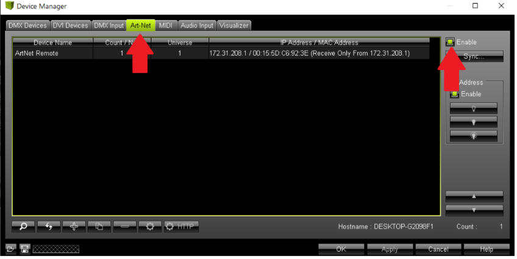

## General Product Issues and Configuration

<strong>SD Card Formatting</strong>

[Video instructions on formatting memory cards](https://www.youtube.com/watch?v=M70LqYyvp_A)

Formatting settings: FAT32 file system.

Copy all files for the controller from our cloud drive. The link is usually provided together with instructions for creating new effects in Madrix. Contact ETEREshop managers if you do not have a link. You can also use your backup copy.

---

<strong>File Structure on the SD Card</strong>

- The SD card must contain a configuration file (`config.txt`) and effect files.
- During activation, the controller creates a `protect.txt` file. Using an activator, a `key.txt` file is generated and placed on the SD card. After successful activation, these files are deleted.
- The effect list is also stored on the SD card. Effect files must follow this naming template:

Where `number` is a digit from 0 to 255. An optional name can follow to highlight the effect.

**Examples:**
- `S1.txt`
- `S16_logo.txt`
- `S21.txt`
- `S50_animated_text.txt`

- Numbering does not need to be sequential.
- You can create folders and store other files — the controller will ignore them.

**For clients:**

1. `config.txt` — product configuration file.  
2. Effect files: format `S<number>.txt`. Examples: `S1.txt`, `S2.txt`, `S5.txt`, `S70.txt`. Numbering does not have to be sequential. You may optionally add a name: `S12_logo.txt`, `S4_text.txt`.  
3. You can create folders and add other files — they will not be recognized by the controller.

---

<strong>Duplicate Files on the SD Card</strong>

- File corruption may occur due to improper card ejection. Always fully power down the controller (disconnect batteries) before removing the card.
- If issues occur, reformat the SD card (see section above).

**Safe SD card handling instructions:**

1. Turn off the product.  
2. Disconnect power from the controller (e.g., remove batteries).  
3. Remove the SD card.  
4. Save or copy necessary files.  
5. Reinsert the SD card and only then turn the product back on.

---

<strong>Product Flashes in Certain Colors</strong>

#### 🔴 Red Flashing

- Issue with the SD card: missing, improperly inserted, or faulty.
- Ensure the card is fully inserted.
- Check the SD card for errors using a USB adapter or card slot. If the computer detects the card but can't open it — format it.
- If the computer doesn't detect it — replace the card.
- If the issue persists, the controller’s SD slot may be damaged. Repair or replacement is required.

#### 🔴🔵 Red and Blue Flashing

- Problem with the activation file.
- Activation failed — possibly due to a wrong or corrupted `key.txt` file.
- Solution: send us the `protect.txt` file from the SD card and we’ll provide a valid key.

#### 🔴🟡 Red and Yellow Flashing

- The controller cannot find the `config.txt` file.
- Ensure the `config.txt` file is present on the SD card.
- If it exists, check the SD card for errors (see red flashing issue above).

#### 🔴🟢 Red and Green Flashing

- The controller cannot recognize DMX settings — most likely the `channels.txt` file is missing.
- Create the file and specify the required channel numbers.

---

## Problems with Effects

<strong> Effect Freezes / Random LEDs Light Up </strong>

#### 🟥 Effect Freezes / Random LEDs Light Up

- The wrong driver was used for recording.
- The system may have another driver version (e.g., `npcap`) installed.
- The recorder software is not compatible with `npcap`. Uninstall it and install `WinPcap`.
- You can check installed drivers via your system’s apps list.

- The `log.txt` is missing. Create an empry file `log.txt`.

 

 
---

<strong> Effect Only Works on Part of Product </strong>

Possible causes:
1. Wrong Madrix project used.  
2. Incorrect network config in the project or wrong `config.txt` on the product.  
3. Madrix license may not have enough universes available.

**Check the following:**
- Make sure you’re using the correct Madrix project for your product.
- Confirm the SD card contains the proper `config.txt`.
- Ensure your Madrix license covers enough universes. You can verify this in the **DMX Devices** tab (F4 or Preferences → Device Manager).

 

 
---

<strong> “Too Long Delay” When Recording Effect </strong>

#### 🕒 “Too Long Delay” When Recording Effect

- Cause: unstable network (e.g., Wi-Fi), leading to packet loss.
- Solution: try recording again, shorten the effect, or use a wired connection.

---

<strong> Madrix Network Config Breaks </strong>

#### ⚙️ Madrix Network Config Breaks

- If you open a new project without restarting Madrix, network settings may merge and cause issues.
- Solution: fully close Madrix before opening a new project.

  

---

<strong>ArtNet Counter Does Not Increase </strong>

   
#### ❌ ArtNet Counter Does Not Increase

Most likely, ArtNet is disabled in your matrix.
You may have forgotten to enable ArtNet support in Matrix. To turn it on, open the device
The manager window (by pressing F4 or by selecting Settings -> Device Manager). Go to the Art-Nettab tab
and check the appropriate box.

---

## Breakdowns

<strong>LED is Constantly Lit Blue/Red/Green/Combination</strong> <em>The Rest of the Product Works Correctly</em>

- A part of the driver responsible for a specific color has burned out in the LED.
- The product can still be used like this if it's not critical for appearance.
- To repair, replace the affected diode.

---

<strong>LED is Constantly Lit in One Color</strong> <em>Part of the Product After It Does Not Work</em>

- The LED has failed and needs to be replaced.

---

<strong>Controller or Wires Get Very Hot When Power is Connected</strong>

- Most likely caused by a short circuit.
- Replace the controller with a repaired one if available, or purchase a new one.
- This could happen if the charger was connected directly to the controller (when there is no BMS), or if liquid was spilled on it.

---

<strong>Product Displays Colors Incorrectly (Blue, Green Disappear), Slows Down or Freezes</strong>

- Caused by over-discharge of batteries.
- Try connecting other charged batteries or power boxes for testing.

---

<strong>Part of the Product is Constantly Lit Blue</strong>

- If the product uses PL-diodes, this indicates a break in the data wire.
- These diodes light up blue by default when there’s no control signal.
- Use the schematic/map to trace and find the break.

---

<strong>Part of the Product Does Not Light Up</strong>

- Use dynamic effects to determine the first unlit diode.
- A data break likely occurred at that point.
- It’s also possible the break occurred right at the controller output — in this case, an entire section will not light up.

---

## Radio Setup

<strong>General Radio Settings</strong>

- Only effect numbers are transmitted via radio, whether using DMX or our radio controllers.
- It is highly recommended to use the first ten radio channels.
- As the channel number increases, signal transmission quality decreases.

---

<strong>Instructions for Two-Button Controller</strong>

Two files must be present on the SD card:

1. `effects.txt` — specifies the number of effects on the product.  
2. `channel.txt` — specifies the radio channel number (1–100).

Additional files:
- `RF_log.txt` and `errors.txt` — generated by the controller to store info about radio settings and operation.

**Button Functions:**
- Switch effects forward/backward.

**LED Indications:**
- Flashing red: radio module not detected; operation not possible.  
- Flashing orange: memory card not found; operates with default 20 effects.  
- Flashing yellow: `effects.txt` is missing or corrupted.  
- Flashing yellow-green: miscellaneous errors; possibly a failed channel change.

---

<strong>Radio Controller Switches All Products Instead of Specific Ones</strong>

- By default, all products are configured to the first channel.
- To assign unique channels, add the following line to each product’s `config.txt`:

Where `N` is a number between 0 and 255 (ideally between 0–10 for best performance).

---

<strong>Radio Controller Does Not Control the Product</strong>

1. Ensure the controller's channel matches the product’s assigned channel.
   - On the remote: selected via buttons.
   - On the product: set in `config.txt`.

2. Confirm the `rh.pattern` parameter exists in the product’s configuration.

3. For older products, there may be incompatibility between the product controller chip and the radio controller chip.
   - You can identify mismatched chips by their shape (square vs. rectangular).
   - Replace the radio controller if needed.

